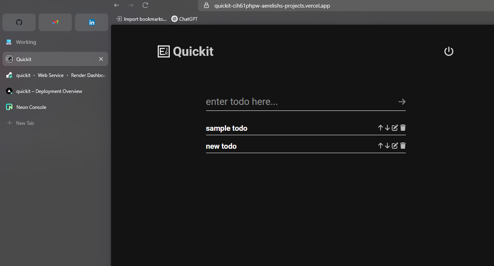
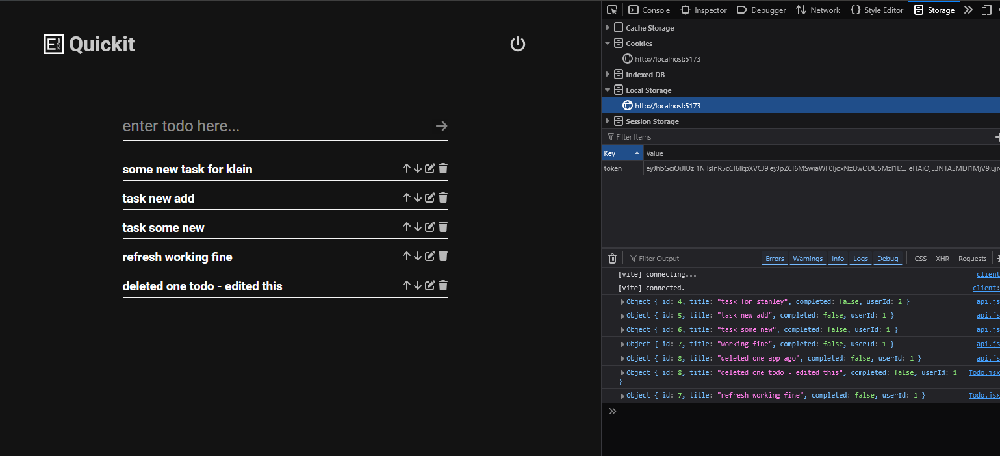

# TODO
- ~~Make App Fullstack~~
- ~~Login/Register Page | Logout~~
- ~~Authentication~~
- ~~Deploy~~
- Create Logs/Logger for Backend
- Fix Responses
- Containerize

### FEATURES TO ADD
- Weather
- Water Intake
- Dark/Light Theme?
- Budget Tracker

### DEV. LOG

**June, 26, 2025**   Worked on deploying fo the first time (for free ofc 😉), using render for the backend, vercel for the frontend, and neon for the postgres database. took longer than expected, there were a lot of changes needed moving from development to deployment. will have to keep this in mind next time when developing.
  
Site is up on https://quickit-cih61phpw-aerelishs-projects.vercel.app/ for now

**June, 25, 2025**   Created login/register pages along with their functionality. Also updated the Todo to be associated for each User and added the JWT authentication for retrieving, creating, updating and deleting todo list.   Noticed that the codebase is starting to get messy, will have to research on how to keep things organized.   The CSS is also getting messy, sooo will be switching to TailwindCSS first before adding the rest of the features, this should help with the responsiveness and the uniform look of the app, hopefully... 🥲😆

