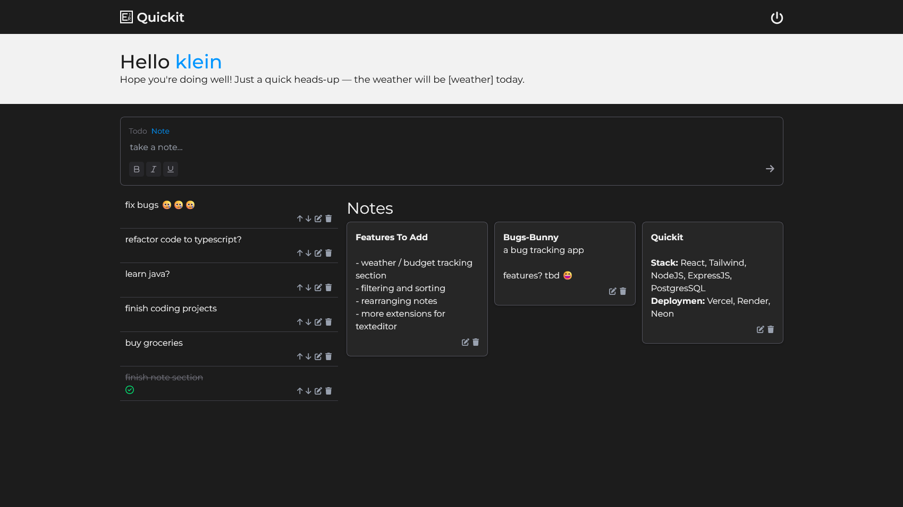

# Quickit - Utility App

An all-in-one productivity tool designed to help users quickly manage everyday mundane tasks like to-do lists, notes, reminders, and more—all in one clean and fast interface.

Yes, this is just a Todo app for now 🥲, but fear not the rest are coming soon sooon sooooon...

## Functionalities

- Simple User Authentication using JWT
- Simple Rich Text Editor using TipiTop
- CRUD Operations for Todo / Notes

## Preview

